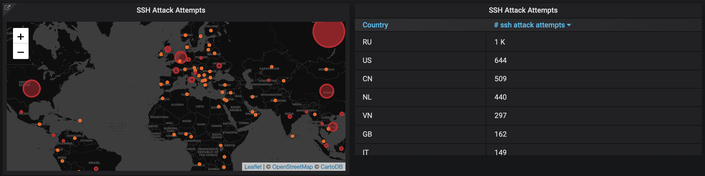

# SSH Log Exporter: Observe Attack Attempts with Prometheus

**WIP**: Prometheus exporter that listens on `/var/log/auth.log` events and exposes counters with the the failed login attempts. Labels (for now): `ip` and `country`.

⚠️ This was written on a Friday night, while drinking some Belgian beers. You better don't look too much at the code, and don't use it in production. 😇🍻

## Usage

    go run sshlogexporter/main.go

## Configurations

Nothing to configure at the moment.

## Acknowledgements

Uses [sirupsen/logrus](https://github.com/sirupsen/logrus) for logging, [hpcloud/tail](https://github.com/hpcloud/tail) for countinously reading the file and [phuslu/geoip](https://github.com/phuslu/geoip) for getting the country of the IPs

## Author

[Mathias Beke](https://denbeke.be)